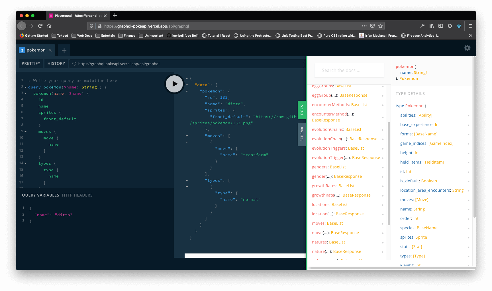

# 🔴 The Unofficial GraphQL for PokeAPI

<p align="center">
	
</p>
<p align="center">
	
	
	
	
</p>



## Homepage

[https://graphql-pokeapi.vercel.app](https://graphql-pokeapi.vercel.app)

## Endpoint

- GraphCDN (with caching): https://graphql-pokeapi.graphcdn.app
- Origin: https://graphql-pokeapi.vercel.app/api/graphql

## Playground

[https://graphql-pokeapi.vercel.app/api/graphql](https://graphql-pokeapi.vercel.app/api/graphql)

## Applications

If you are using `graphql-pokeapi`, you can add your apps in our [awesome-list.md](awesome-list.md)

## Sending Request Example

- WIP - [Sending request using Fetch API - GET](examples/01-use-fetch-get.js)
- [Sending request using Fetch API - POST](examples/02-use-fetch-post.js)
- WIP - [Sending request using Apollo - GET](examples/03-use-apollo-get.js)
- [Sending request using Apollo - POST](examples/04-use-apollo-post.js)

## Queries

| Query               | Desc                           | Variables         |
| ------------------- | ------------------------------ | ----------------- |
| `abilities`         | Get list of abilities          |                   |
| `ability`           | Get detail of ability          | `ability`         |
| `berries`           | Get list of berries            |                   |
| `berry`             | Get detail of berry            | `berry`           |
| `eggGroups`         | Get list of egg groups         |                   |
| `eggGroup`          | Get detail of egg group        | `eggGroup`        |
| `encounterMethods`  | Get list of encounterMethods   |                   |
| `encounterMethod`   | Get detail of encounterMethod  | `encounterMethod` |
| `evolutionChains`   | Get list of evolutionChains    |                   |
| `evolutionChain`    | Get detail of evolutionChains  | `id`              |
| `evolutionTriggers` | Get list of evolutionTriggers  |                   |
| `evolutionTrigger`  | Get detail of evolutionTrigger | `name`            |
| `genders`           | Get list of genders            |                   |
| `gender`            | Get detail of gender           | `gender`          |
| `growthRates`       | Get list of growth rates       |                   |
| `growthRate`        | Get detail of growth rate      | `growthRate`      |
| `locations`         | Get list of locations          |                   |
| `location`          | Get detail of location         | `location`        |
| `moves`             | Get list of moves              |                   |
| `move`              | Get detail of move             | `move`            |
| `natures`           | Get list of natures            |                   |
| `nature`            | Get detail of nature           | `nature`          |
| `pokemons`          | Get list of pokemons           | `limit`, `offset` |
| `pokemon`           | Get detail info of pokemon     | `name`            |
| `regions`           | Get list of regions            |                   |
| `region`            | Get detail of region           | `region`          |
| `species`           | Get list of species            |                   |
| `types`             | Get list of types              |                   |

## Query Examples

### pokemons

Desc: Get list of pokemons

<details>
  <summary>Sample Query</summary>
  <p>

```js
query pokemons($limit: Int, $offset: Int) {
  pokemons(limit: $limit, offset: $offset) {
    count
    next
    previous
    status
    message
    results {
      url
      name
      image
    }
  }
}
```

</p>
</details>

<details>
  <summary>Sample Variables</summary>
  <p>

```js
{
  "limit": 2,
  "offset": 1
}
```

</p>
</details>

<details>
  <summary>Sample Result</summary>
  <p>

```js
{
  "data": {
    "pokemons": {
      "count": 964,
      "next": "https://pokeapi.co/api/v2/pokemon/?offset=3&limit=3",
      "previous": null,
      "results": [
        {
          "url": "https://pokeapi.co/api/v2/pokemon/1/",
          "name": "bulbasaur",
          "image": "https://raw.githubusercontent.com/PokeAPI/sprites/master/sprites/pokemon/1.png"
        },
        {
          "url": "https://pokeapi.co/api/v2/pokemon/2/",
          "name": "ivysaur",
          "image": "https://raw.githubusercontent.com/PokeAPI/sprites/master/sprites/pokemon/2.png"
        },
        {
          "url": "https://pokeapi.co/api/v2/pokemon/3/",
          "name": "venusaur",
          "image": "https://raw.githubusercontent.com/PokeAPI/sprites/master/sprites/pokemon/3.png"
        }
      ],
      "status": true,
      "message": ""
    }
  }
}
```

</p>
</details>

### pokemon

Desc: Get detail info of pokemon

<details>
  <summary>Sample Query</summary>
  <p>

```js
query pokemon($name: String!) {
  pokemon(name: $name) {
    id
    name
    abilities {
      ability {
        name
      }
    }
    moves {
      move {
        name
      }
    }
    types {
      type {
        name
      }
    }
    message
    status
  }
}
```

</p>
</details>

<details>
  <summary>Sample Variables</summary>
  <p>

```js
{
  "name": "ditto"
}
```

</p>
</details>

<details>
  <summary>Sample Result</summary>
  <p>

```js
{
  "data": {
    "pokemon": {
      "id": 132,
      "name": "ditto",
      "abilities": [
        {
          "ability": {
            "name": "imposter"
          }
        },
        {
          "ability": {
            "name": "limber"
          }
        }
      ],
      "moves": [
        {
          "move": {
            "name": "transform"
          }
        }
      ],
      "types": [
        {
          "type": {
            "name": "normal"
          }
        }
      ],
      "message": "",
      "status": true
    }
  }
}
```

</p>
</details>

## Credits

- [PokeAPI](https://github.com/PokeAPI/pokeapi)
- [Pokedex Promise V2](https://github.com/PokeAPI/pokedex-promise-v2#pokemon)
- [Apollo Server Vercel](https://github.com/Saeris/apollo-server-vercel)
- [Vercel](https://vercel.com/)
- [JS Escaper Tool](https://www.freeformatter.com/javascript-escape.html#ad-output)

---

Copyright © By Irfan Maulana
